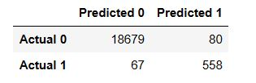
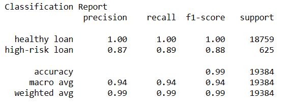
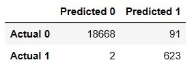
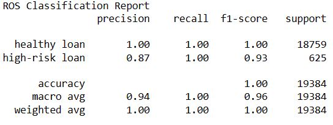

# credit-risk-classification

## Introduction
Use various techniques to train and evaluate a model based on loan risk. You’ll use a dataset of historical lending activity from a peer-to-peer lending services company to build a model that can identify the creditworthiness of borrowers.

## Sources of data
Within Resources Folder:
*  lending_data.csv

## Findings
### Logistic Regression Model with the Original Data:

* Precision measures the proportion of correctly predicted instances out of the total predicted instances for a specific label. For the "healthy loan" class, the precision is 1.00, indicating that the model predicts this label with perfect precision. For the "high-risk loan" class, the precision is 0.87, meaning that 87% of the predicted high-risk loans are correct.

* Recall, also known as sensitivity or true positive rate, measures the proportion of correctly predicted instances out of the total actual instances for a specific label. The recall for the "healthy loan" class is 1.00, indicating that the model captures all the actual healthy loans. The recall for the "high-risk loan" class is 0.89, meaning that the model identifies 89% of the high-risk loans correctly.

* The F1-score is the mean of precision and recall and provides a balanced measure of the model's performance. For the "healthy loan" class, the F1-score is 1.00, indicating perfect performance. The F1-score for the "high-risk loan" class is 0.88, representing a good balance between precision and recall for this label.

* The accuracy score is 99%, this model performs exceptionally well.

* One improvement would be, to get the 'False Negative' value (67) lower, as we would want to migtigate away from it as much as possible. In certain situations, such as identifying potential high-risk loans or detecting fraudulent activities, false negatives can result in missed opportunities. By minimising false negatives, we increase the chances of correctly identifying positive instances, enabling us to take appropriate actions and capitalise on those opportunities.

### Logistic Regression Model with with Resampled Training Data:

* For the "healthy loan" class, the precision is 1.00, indicating that the model predicts this label with perfect precision. For the "high-risk loan" class, the precision is 0.87, meaning that 87% of the predicted high-risk loans are correct.

* The recall for both the "healthy loan" and "high-risk loan" classes is 1.00, indicating that the model captures all the actual instances of both classes.
  
* For the "healthy loan" class, the F1-score is 1.00, indicating excellent performance. The F1-score for the "high-risk loan" class is 0.93, representing a good balance between precision and recall for this label.

* The accuracy score is 100%, this model performs exceptionally well.

* This model was able to reduce the value of False Negative all the way from 67 down to 2, which I am extremely happy with. This increase the chances of correctly identifying positive instances, enabling us to take appropriate actions and capitalise on those opportunities of identifying potential high-risk loans or detecting fraudulent activities. False negatives can lead to wasted resources when subsequent actions, investigations, or interventions are not performed when they should have been. By minimising false negatives, we can optimise resource allocation, focusing efforts on instances that truly require attention. Lastly, false negatives can erode trust in the predictive model or system. If users consistently encounter false negatives, they may lose confidence in the model's ability to accurately identify positive instances. This loss of trust can have a detrimental impact on the reputation and adoption of the model or system. By striving to minimise false negatives, we can enhance the reliability and credibility of the predictions, fostering trust among users.

## Conclusion
Based on the above factors, the "logistic regression model fit with oversampled data" would be preferred over the "logistic regression model fit with the original data." The model trained with oversampled data shows improved performance in correctly identifying instances of the "high-risk loan" class, resulting in higher recall and F1-score. Additionally, the reduction in false negatives is crucial for effectively identifying high-risk loans and mitigating potential risks.

# Project Outline

## Instructions

The instructions for this Challenge are divided into the following subsections:

* Split the Data into Training and Testing Sets
* Create a Logistic Regression Model with the Original Data
* Write a Credit Risk Analysis Report

### Split the Data into Training and Testing Sets

Open the starter code notebook and use it to complete the following steps:
1.  Read the lending_data.csv data from the Resources folder into a Pandas DataFrame.
2.  Create the labels set (y) from the “loan_status” column, and then create the features (X) DataFrame from the remaining columns.
3.  Split the data into training and testing datasets by using train_test_split.

### Create a Logistic Regression Model with the Original Data

Use your knowledge of logistic regression to complete the following steps:
1. Fit a logistic regression model by using the training data (X_train and y_train).
2. Save the predictions for the testing data labels by using the testing feature data (X_test) and the fitted model.
3. Evaluate the model’s performance by doing the following: generate a confusion matrix, print the classification report.
4. Answer the following question: How well does the logistic regression model predict both the 0 (healthy loan) and 1 (high-risk loan) labels?

## Write a Credit Risk Analysis Report

Write a brief report that includes a summary and analysis of the performance of the machine learning models that you used in this homework. You should write this report as the README.md file included in your GitHub repository.

Structure your report by using the report template that Starter_Code.zip includes, ensuring that it contains the following:
1. An overview of the analysis: Explain the purpose of this analysis.
2. The results: Using a bulleted list, describe the accuracy score, the precision score, and recall score of the machine learning model.
3. A summary: Summarize the results from the machine learning model. Include your justification for recommending the model for use by the company. If you don’t recommend the model, justify your reasoning.
